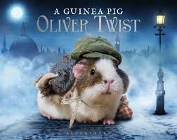

##  Interactions

Linear models are easily extended to accommodate any number of variables. Variables may each contribute independently to a response, or they may work together to influence response values.

*Interaction effects* are important when the association between one independent variable and the response may depend on the level of another independent variable. 
[Click this link for insight on what interactions imply in terms of group means](https://courses.washington.edu/smartpsy/interactions.htm)

## Interaction Example

For example, suppose that we are interested in a two-way ANOVA model in which the response $y$ is a measure of headache pain, and the independent variables include the type of pill taken (placebo (j=1) or ibuprofen (j=2)) and the number of pills taken (k=1 or k=2). While we may expect lower pain if multiple ibuprofen pills are taken, we would not expect the same decrease in pain if multiple placebo pills were taken. 


Consider the model $y_{ijk}=\mu + \alpha I(j=2) + \beta I(k=2) + \gamma I(j=k=2)+\varepsilon_{ijk}$.

##

$y_{ijk}=\mu + \alpha I(j=2) + \beta I(k=2) + \gamma I(j=k=2)+\varepsilon_{ijk}$

In this model, the mean is parameterized as follows.

| Drug | \# of Pills | Mean |
| ---- | :-----------: | :----: |
| Placebo | 1 | $\mu$ | 
| Placebo | 2 | $\mu+\beta$ |
| Ibuprofen | 1 | $\mu+\alpha$ |
| Ibuprofen | 2 | $\mu +\alpha+\beta+\gamma$ |


What types of parameter values would we expect to see if there is an interaction in which there is a dose effect for Ibuprofen but not for placebo?

  
##

$y_{ijk}=\mu + \alpha I(j=2) + \beta I(k=2) + \gamma I(j=k=2)+\varepsilon_{ijk}$

In this model,

  - the expected difference in pain level moving from 1 to 2 ibuprofen pills is $\mu+\alpha - \mu - \alpha - \beta - \gamma$
  - the expected difference in pain level moving from 1 to 2 placebo pills is $\mu - \mu - \beta$
  - the expected drug effect for those taking one pill is $\mu+\alpha-\mu=\alpha$
  - the expected drug effect for those taking two pills is $\mu+\alpha+\beta+\gamma - \mu - \beta=\alpha+\gamma$
  
  
So no interaction ($\gamma=0$) means that the drug effect is the same regardless of the number of pills taken. For there to be no drug effect at all, we need $\gamma=0$ and $\alpha=0$.  


## R's Most Exciting Data

Get ready -- we are going to explore R's most thrilling data -- the famous tooth growth in Guinea pigs data!



Ahh, how cute!  Our Dickensian guinea pig has a mystery to solve -- which type of Vitamin C supplement is best for tooth growth!

##


Guinea pig dental problems are NOT fun. Our dataset (Crampton, 1947) contains as a response the length of odontoblasts (cells responsible for tooth growth) in 60 guinea pigs, each of which receives one dose of vitamin C (0.5, 1, or 2 mg/day) via one of two delivery methods (orange juice (OJ) or ascorbic acid (VC)). Researchers wanted to know if the odontoblast length could be used as a marker of Vitamin C uptake, for the purposes of providing better nutritional supplementation to members of the Canadian armed forces (alas, the first of many injustices for Oliver Twisted Teeth -- the study was not done to help little Guinea piggies).

##


```{r guineadescriptives0,echo=TRUE, eval=FALSE}
library(ggplot2)
gp=ToothGrowth
gp$dose=as.factor(gp$dose)
# Default bar plot
p<- ggplot(gp, aes(x=dose, y=len, fill=supp)) + 
  geom_bar(stat="identity", position=position_dodge()) 
# Finished bar plot
p+labs(title="Odontoblast length by dose", x="Dose (mg)", y = "Length")+
   theme_classic() +
   scale_fill_manual(values=c('#999999','#E69F00'))

```

##

```{r guineadescriptives,echo=FALSE, warning=FALSE, out.width="50%"}
library(ggplot2)
gp=ToothGrowth
gp$dose=as.factor(gp$dose)
# Default bar plot
p<- ggplot(gp, aes(x=dose, y=len, fill=supp)) + 
  geom_bar(stat="identity", position=position_dodge()) 
# Finished bar plot
p+labs(title="Odontoblast length by dose", x="Dose (mg)", y = "Length")+
   theme_classic() +
   scale_fill_manual(values=c('#E69F00','#999999'))

```

Looking at the boxplot of the growth data, what type of ANOVA model may be most appropriate?  Take a moment to write a model in matrix notation -- then we will consider possible choices.

## Your task (individual assignment)!

1. Under your ANOVA model, write out (in terms of parameters) the means for each combination of supplement type and dose.
2. Fit your model and provide a short summary of the analysis in language accessible to the general public.
3. Suppose that greater lengths are indicative of better absorption. Make a recommendation for the dose(s) and supplement type(s) to be used to deliver vitamin C to armed forces members, assuming that the goal is to maximize absorption of vitamin C. Use statistical evidence to support your recommendation.
4. Conduct diagnostic checks to see how well the assumptions behind your model are satisfied. Are there any reasons for concern about your model choice?


