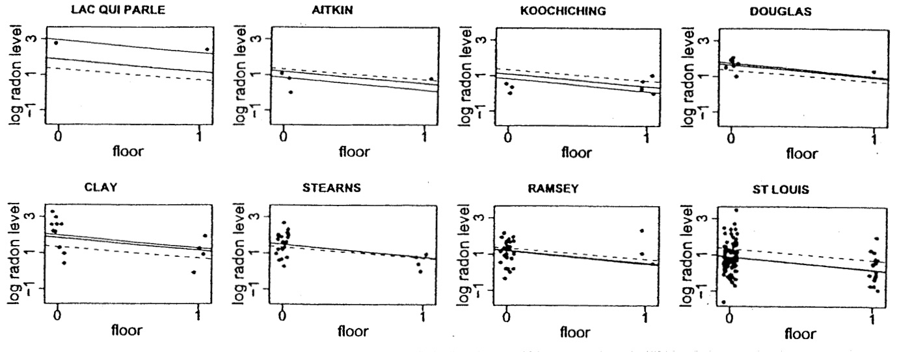
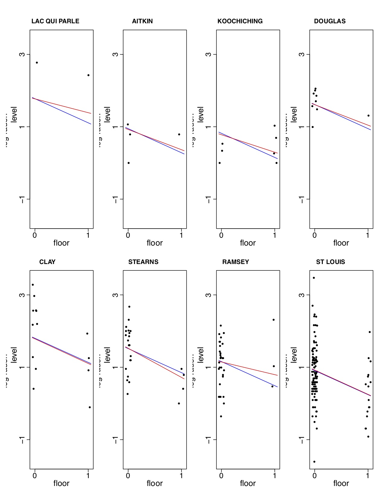

```{r setup, include=FALSE}
library(kableExtra)
library(knitr)
library(tidyverse)
srrs2 <- read.table ("srrs2.dat", header=T, sep=",")
mn <- srrs2$state=="MN"
radon <- srrs2$activity[mn]
log.radon <- log (ifelse (radon==0, .1, radon))
floor <- srrs2$floor[mn]   # 0 for basement, 1 for first floor
n <- length(radon)
y <- log.radon
x <- floor

county.name <- as.vector(srrs2$county[mn])
uniq <- unique(county.name)
J <- length(uniq)
county <- rep (NA, J)
for (i in 1:J){
  county[county.name==uniq[i]] <- i
}

srrs2.fips <- srrs2$stfips*1000 + srrs2$cntyfips
cty <- read.table ("cty.dat", header=T, sep=",")
usa.fips <- 1000*cty[,"stfips"] + cty[,"ctfips"]
usa.rows <- match (unique(srrs2.fips[mn]), usa.fips)
uranium <- cty[usa.rows,"Uppm"]
u <- log (uranium)
u.full<-u[county]
```


## Motivating Example: Radon Study

Radon, a naturally-occurring radioactive gas, is a carcinogen known to cause lung cancer in high concentrations.  Several thousand lung cancer deaths in the US per year are attributable to radon exposure.

Radon levels in US homes vary greatly, and some homes have dangerously high radon levels.  In order to identify areas of the US with high radon exposures, the US EPA conducted a study of radon levels in a random sample of more than 80,000 homes. 

[Click here](https://www.epa.gov/radon/find-information-about-local-radon-zones-and-state-contact-information#radonmap) to check highest recorded radon levels across the US. 

(This example is taken from the excellent book by Gelman and Hill.)

## Radon study

We wish to estimate the distribution of radon levels in houses $i$ within 85 counties $j$ in Minnesota. The outcome $y_{ij}$ is the natural log of measured radon levels. 

- One estimate would be the average of all radon levels in Minnesota (same estimate for all counties), $\overline{y}_{\cdot \cdot}$, but this ignores variation across counties, and some counties may have higher radon levels naturally than others (radon is more commonly found in soils with granite rock, as opposed to some other soil types).

- Another estimate would be just to average the radon level in each
  county, $\overline{y}_j$, which can over-fit the data within county (for example, Lac Qui Parle County, which has the highest observed radon level of all the 85 MN counties, has radon measures from only 2 homes). This is similar to using an ANOVA model with a *fixed effect* for county.

## 
{width=50%}

Note we get pretty good (low variance) estimates in counties where more samples were taken, while our estimates are not great in counties where just a few samples were obtained. 

##

The figure contrasts two extreme approaches to obtaining estimates of group means $\mu_j$ in this type of setting.  A common procedure might be the following.  Fit the ANOVA model $y_{ij}=\mu+\alpha_j+\varepsilon_{ij}$, where $\varepsilon_{ij} \sim N(0,\sigma^2)$, testing the significance of the groups using an overall F test (here, an 84 degree of freedom test, as we're testing all 85 means are the same).

  - If $p<0.05$, use the estimate $\widehat{\mu}_j=\overline{y}_j$ for the mean in each county
  - If $p>0.05$, use the estimate $\widehat{\mu}_j=\overline{y}$ for the mean in each county
  
With either case, we will be using sub-optimal estimates for some counties, and the above method is fairly extreme (all or nothing one way or the other!).

## 

An improvement might be using the estimate $\overline{y}_j$ for counties with sufficient sample size and the estimate $\overline{y}$ for counties where the variability is too high.  

Important question: how do we define "sufficient" and "too high"?

## Random Effects ANOVA

*Random effects* ANOVA is a special case of a *hierarchical* or *multilevel* linear model that provides a nice framework for borrowing information across groups when needed to stabilize estimates.  We can specify such a model as $y_{ij}=\mu+\alpha_j+\varepsilon_{ij}$, where $\varepsilon_{ij} \overset{iid}{\sim} N(0,\sigma^2)$ and $\alpha_j \overset{iid}{\sim} N(0,\tau^2)$. The model on $\alpha_j$ allows us to borrow information in order to obtain better group-specific estimates when needed; because $\alpha_j$ is now viewed as random, the model can be called a *random effects* model. 

This particular model is sometimes called a *random intercept* model because each group has its own intercept, $\mu_j=\mu+\alpha_j$, that follows a Gaussian distribution.

## Random Effects ANOVA for Radon Data


{width=50%}
    
## Radon study

The multilevel estimates in the previous slide represent a compromise between the two extremes.  In this simple setting (with no predictors), the multilevel estimate for county $j$ can be approximated as a weighted average of the mean of all observations in the county, weighting both the unpooled estimate $\overline{y}_j$ and the mean over all counties $\overline{y}$.

## 

How does random effects ANOVA borrow information?

The multilevel estimate

$$\widehat{\mu}_j \approx
\frac{\frac{n_j}{\sigma^2}\overline{y}_j+\frac{1}{\tau^2}\overline{y}}{\frac{n_j}{\sigma^2}+\frac{1}{\tau^2}},$$
   
where 
    
- $n_j$ is the number of homes measured in county $j$

- $\sigma^2$ is the within-county variance in the log radon
  measurements
  
- $\tau^2$ is the variance across the average log radon
  levels of different counties

## 

The weighted average reflects the relative amount of information available on each individual county, compared to that available across all counties.

- Averages from counties with smaller sample sizes are less precise, so the weighting shrinks the multilevel estimates closer to the overall state average.  For example, if $n_j=0,$ the multilevel estimate is just $\overline{y}$.

- Averages from counties with larger sample sizes are more precise, and the multilevel estimates are closer to the county averages.  As $n_j \rightarrow \infty$, the multilevel estimate is just the county average $\overline{y}_j$.

- In intermediate cases, the multilevel estimate is in between the
  extremes.
  
In practice, we carry out all estimation together (estimate variances along with the mean parameters), but we won't worry about this yet.

## Understanding the Model

These estimates are often called *shrinkage estimates*, as they "shrink" the no pooling estimates back towards the complete pooling mean, to an extent determined by the information in the data.

Next we formalize the model and consider some of its features and implications.

## Random Intercept Model

This model is a special case of a *random intercept* model in which covariates are categorical.  Note some consequences of this model.


$y_{ij}=\mu+\alpha_j+\varepsilon_{ij}$, where $\varepsilon_{ij} \overset{iid}{\sim} N(0,\sigma^2)$ $\perp$ $\alpha_j \overset{iid}{\sim} N(0,\tau^2)$

$E[y_{ij}]=E[\mu+\alpha_j+\varepsilon_{ij}]=\mu+0+0=\mu$
\begin{eqnarray*}
\text{Var}[y_{ij}]&=&E[(y_{ij}-E(y_{ij}))^2] \\
&=& E[(\mu+\alpha_j+\varepsilon_{ij}-\mu)^2] \\
&=& E[(\alpha_j+\varepsilon_{ij})^2] \\
&=& E[\alpha_j^2+2\alpha_j\varepsilon_{ij}+\varepsilon_{ij}^2] \\
&=& \tau^2+0+\sigma^2=\sigma^2+\tau^2
\end{eqnarray*}

##
For two observations in different groups j and j',
\begin{eqnarray*}
\text{Cov}(y_{ij},y_{i'j'})&=& E[(y_{ij}-E(y_{ij}))(y_{i'j'}-E(y_{i'j'}))] \\
&=& E(y_{ij}y_{i'j'})-\mu^2-\mu^2+\mu^2 \\
&=& E(y_{ij})E(y_{i'j'})-\mu^2=\mu^2-\mu^2=0
\end{eqnarray*}

\vspace{.1in}

For two observations in the same group j,
\begin{eqnarray*}
\text{Cov}(y_{ij},y_{i'j})&=& E[(y_{ij}-E(y_{ij}))(y_{i'j}-E(y_{i'j}))] \\
&=& E(y_{ij}y_{i'j})-\mu^2-\mu^2+\mu^2 \\
&=& E[(\mu+\alpha_j+\varepsilon_{ij})(\mu+\alpha_j + \varepsilon_{i'j})] \\
&=& E[\mu^2+\mu\alpha_j+\mu\varepsilon_{i'j}+\alpha_j\mu+\alpha_j^2+\alpha_j\varepsilon_{i'j}+ \\
& & ~~~~~\varepsilon_{ij}\mu+\varepsilon_{ij}\alpha_j+\varepsilon_{ij}\varepsilon_{i'j}] \\ 
&=& \mu^2 + 0 + 0 + 0 + \tau^2 + 0 + 0 + 0 + 0 -\mu^2=\tau^2
\end{eqnarray*}

## Intraclass Correlation

The correlation between two observations in the same group is 

\begin{eqnarray*}
\text{Corr}(y_{ij},y_{i'j})&=&\frac{\text{Cov}(y_{ij},y_{i'j})}{\sqrt(\text{Var}(y_{ij}))\sqrt(\text{Var}(y_{i'j}))} \\
&=& \frac{\tau^2}{\sigma^2+\tau^2}
\end{eqnarray*}

This motivates the use of random effects ANOVA to handle cases in which we expect subgroups of observations to be correlated (e.g., repeated measures or family studies).

##

It is often convenient to stack our observations into a long vector $Y_{N \times 1}$ organized by groups.  For simplicity in exposition, assume $n_j=n$ and the total sample size $N=nJ$. Then assuming $Y$ follows a multivariate normal distribution (which follows from our specification previously), we can express $$\text{Cov}(Y)=\sigma^2I_{N\times N} + \tau^2 \begin{pmatrix} J_n & 0 & \cdots & 0 \\ 0 & J_n & \cdots & 0 \\
\vdots & \vdots & \vdots & \vdots \\ 0 & 0 & \cdots & J_n \end{pmatrix}=I_J \otimes V,$$ where $V=\sigma^2I_n+\tau^2J_n$ and $J_n$ is an $n \times n$ matrix of 1's.

## Kronecker product

The *Kronecker product* is a convenient way to express patterned covariance matrices (among other things).  For matrices $A_{m \times n}$ and $B_{p \times q}$, the *Kronecker product* $A \otimes B=\begin{bmatrix}a_{11}B & \cdots & a_{1n}B \\ \vdots & \ddots & \vdots \\ a_{m1}B & \cdots & a_{mn}B \end{bmatrix}$.

Using a Kronecker product, we can succinctly express the block diagonal covariance matrix of all our observations when we have equal numbers of observations in each group.


## Estimation Methods

We briefly consider the following estimation methods for random intercept models.

  - Maximum likelihood (ML)
  
  - Restricted maximum likelihood (REML)
  
  - Empirical Bayes estimation
  

## Maximum Likelihood Estimation

We can also think of this formulation in the framework of the general linear mixed effects model, where $$y=X\beta+Zb+\varepsilon.$$ In the random effects ANOVA case, 

  - $X$ is just a column of 1's specifying the intercept $\beta=\mu$ 
  - $Z$ is a matrix of indicator variables indicating group membership 
  - Assume the random effects $b \sim N(0,G)$ where $G=\tau^2I$ and the errors $\varepsilon \sim N(0,R)$ where $R=\sigma^2I$
  
  The covariance matrix $\Sigma$ is then given by 
\begin{eqnarray*}
\Sigma&=&\text{Var}(y)=\text{Var}(X\beta+Zb+\varepsilon) \\
&=& \text{Var}(X\beta)+\text{Var}(Zb)+\text{Var}(\varepsilon)  \\
&=& Z\text{Var}(b)Z' + \text{Var}(\varepsilon) = ZGZ'+R =\tau^2ZZ'+\sigma^2I
\end{eqnarray*}

##

Assuming our $N$ outcomes follow the multivariate Gaussian distribution, our likelihood is given by $$\frac{1}{(2\pi)^\frac{N}{2}|\Sigma|^\frac{1}{2}}\exp\left(-\frac{1}{2}(y-X\beta)'\Sigma^{-1}(y-X\beta)\right),$$

and we often work with the log-likelihood, given by

\begin{eqnarray*}
\ell(y,\beta,\Sigma)&=&-\frac{1}{2}\left\{N\log(2\pi) + \log |\Sigma| + (y-X\beta)'\Sigma^{-1}(y-X\beta)   \right\} \\
&\propto& \log |\Sigma| + (y-X\beta)'\Sigma^{-1}(y-X\beta),
\end{eqnarray*}

which we then minimize (as I took the negative) in order to find the MLE.

## MLE for Simplest Case

Consider a one-sample setting in which we wish to estimate the sample mean $\mu$ and variance $\sigma^2$ using the model $y_{i}=\mu+\varepsilon_{i}$, $i=1,\ldots,n$, $\varepsilon_i \sim N\left(0,\sigma^2\right)$.

Then our log-likelihood is proportional to $n\log\sigma^2 + \frac{\sum(y_i-\mu)^2}{\sigma^2}$, and to find the MLE's of $\mu$ and $\sigma^2$, when you take derivatives and solve for zero, you obtain $\widehat{\mu}=\overline{y}$ and $\widehat{\sigma}^2=\frac{\sum (y_i-\overline{y})^2}{n}$. 

Typically we don't use the MLE to estimate $\sigma^2$ because of its well-known small-sample bias, instead using the unbiased estimate $s^2=\frac{\sum (y_i-\overline{y})^2}{n-1}=\frac{n}{n-1}\widehat{\sigma}^2$.


## Radon Redux: Adding a Grouping Factor

One important predictor of radon levels is the floor on which the measurement is taken:  basement ($x_i=0$) or first floor ($x_i=1$). Radon comes from underground and can enter more easily when the house is built into the ground; in addition, basements tend to have higher levels than ground floors.

First, we examine the complete-pooling regression, $y_{ij}=\alpha+\beta x_{ij} + \varepsilon_{ij}$, and the no-pooling regression $y_{ij}=\alpha_{j}+\beta x_{ij} + \varepsilon_{ij}$, where $\alpha_{j}$ is the mean log radon level from basement
measures of homes (indexed by i) in county $j$. 

The following plot shows the dashed lines $\widehat{y}=\widehat{\alpha}+\widehat{\beta} x$ for eight selected counties from the complete pooling model, and the solid lines
$\widehat{y}=\widehat{\alpha}_j+\widehat{\beta}x$ from no pooling model.

## No pooling and pooling

{width=100%}
  
## Interpretation

The estimates of $\beta$ (the association between floor of home and radon level) differ slightly for the two regressions, with $\widehat{\beta}=-0.61$ for the pooling model, and $\widehat{\beta}=-0.72$ for the no-pooling model. As we might expect, we tend to have higher radon levels in the basement (p<0.0001).  

Neither analysis is perfect.  The complete-pooling analysis ignores variation in radon levels between counties, which is undesirable because our goal is to identify counties with high-radon homes -- we can't pool away the main
research question!  The no-pooling analysis is also problematic -- for example the Lac Qui Parle County line is estimated based on just two data points.

## Multilevel model

We will start with a simple multilevel model, $y_{ij}=\gamma_0 +
\alpha_{j}+\beta x_{ij} + \varepsilon_{ij}$, where now $\alpha_{j} \sim N(0,\tau^2)$ and $\varepsilon_{ij} \sim N(0, \sigma^2)$.  We fit this model using the lmer() function in the lme4 package.

This model can also be parameterized $y_{ij} \sim N(\alpha_{j}+\beta x_{ij}, \sigma^2),$ 

$\alpha_j \sim N\left(\gamma_0,\tau^2 \right)$

## Code to fit models

Data: [srrs2.dat](data/srrs2.dat)

```{r readsetup}
srrs2 <- read.table ("srrs2.dat", header=T, sep=",")
mn <- srrs2$state=="MN" 
radon <- srrs2$activity[mn]
log.radon <- log (ifelse (radon==0, .1, radon))
floor <- srrs2$floor[mn]   # 0 for basement, 1 for first floor, 9 for missing (no missing in minnesota)
n <- length(radon)
y <- log.radon
x <- floor

county.name <- as.vector(srrs2$county[mn])
uniq <- unique(county.name)
J <- length(uniq)
county <- rep (NA, J)
for (i in 1:J){
  county[county.name==uniq[i]] <- i
}

```

```{r fitsimplemodels, eval=FALSE}
###pooled model
lm.pooled<-lm(formula=y~x)
summary(lm.pooled)
###unpooled  model
lm.unpooled<-lm(formula=y~x+factor(county)-1)
summary(lm.unpooled)
```

##

```{r fitsimplemodels2, echo=FALSE}
###pooled model
lm.pooled<-lm(formula=y~x)
summary(lm.pooled)
```

##

```{r fitsimplemodels3, echo=FALSE}
###unpooled  model
lm.unpooled<-lm(formula=y~x+factor(county)-1)
summary(lm.unpooled)
```


##

```{r lmer, eval=FALSE}
#basic MLM with just random intercept for county
library(lme4)
M1<-lmer(y~x+(1|county),REML=FALSE)
summary(M1)
coef(M1)
```


##

```{r lmer2, echo=FALSE}
library(lme4)
#basic MLM with just random intercept for county
M1<-lmer(y~x+(1|county),REML=FALSE)
summary(M1)
coef(M1)
```


```{r M2}
library(lme4)
#basic MLM with just random intercept for county, fit using REML
M2<-lmer(y~x+(1|county))
```

## Output from MLM
```{r M2out}
summary(M2)
```

<small> The ratio of county-level variance to total variance is an estimate of the correlation of within-county measures. Here $\widehat{\rho}=\frac{.1077}{.1077+.5709}=0.16$. </small>

## County-level estimates
```{r M2colevel}
coef(M2)
```

The first column gives estimates of $\alpha_j$, and the second column gives the estimate of $\beta$ (does not vary over county $j$ according to the model we specified).


## Multilevel model fit
{width=90%}
    
Note that there is strong pooling in counties with few data points (multilevel
line is closer to the dashed line, as in Lac Qui Parle county), and weak
pooling in counties with more data points (multilevel line is on top of no pooling line in St. Louis county).

## Adding a county-level covariate

Radon comes from uranium that has been in the ground since the earth's
formation.  A measure of average uranium content of the soil was available at
the county level (but not for each house).  Recall our current model to
account for variability across counties due to uranium levels in the soil:
$y_{ij}=\alpha_j+\beta x_i + \varepsilon_{ij},$ where $\alpha_{j} \sim
N(\gamma_0,\tau^2)$ $\perp$ $\varepsilon_{ij} \sim N(0,\sigma^2)$.
To include the county-level uranium measure, $u_j$, as a predictor, we just
modify the model so that $\alpha_{j} \sim N(\gamma_0 + \gamma_1
u_j,\tau^2)$.

## Code for including uranium
```{r M2b}
# Extended model adding uranium but still only letting county effect be random
M2<-lmer(y~x+u.full+(1|county))

```

## Uranium model output
```{r M2outb}
summary(M2)
```
## Uranium model coefficients
```{r M2coefb}
coef(M2) 
```

## Model with and without uranium

{width=90%}


## Allowing home floor term to vary by county

We could also allow the effect of home floor to vary by group:

$y_{ij}=\alpha_j+\beta_j x_{ij} + \varepsilon_{ij}$, where $\varepsilon_{ij} \sim N(0,\sigma^2)$ and 

$\left( \begin{array}{c} \alpha_j \\ \beta_j \end{array}\right) \sim N \left( \left( \begin{array}{c} \gamma_0 + \gamma_1u_j \\ \gamma_2 \end{array} \right), \left( \begin{array}{cc} \tau_1^2 & \rho \tau_1 \tau_2 \\ \rho \tau_1 \tau_2 & \tau_2^2 \end{array} \right) \right)$


This model is called a random intercepts and slopes model.

## Code to allow varying home floor term
```{r M3}
M3<-lmer(y~x+u.full+(1+x|county),control = lmerControl(optimizer ="Nelder_Mead")) 
#changing optimizer from default due to convergence issue
```

## Output

```{r M3out}
summary(M3)
```
Note the uncertainty around the random effect of floor is large; we may want to eliminate this random term from the model to simplify things.

## Estimates of county-level effects
```{r M3est}
coef(M3)
```

## Model with and without varying "slope" for floor

{width=40%}

## Summary

Multilevel models can provide a good fit to the data that is a compromise between complete and no pooling across groups. They are often used to handle correlated data due to clustering, such as neighborhood or family effects.