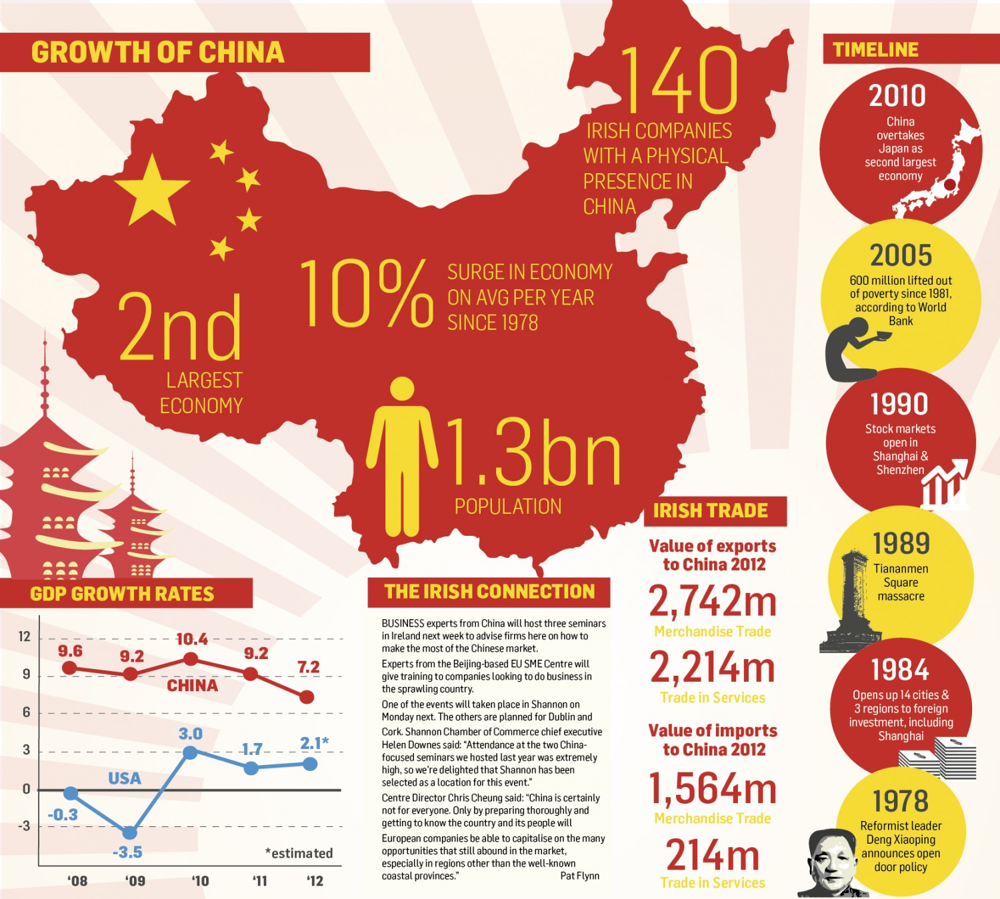

---
title: 'Case Study 2: China''s Economic Transformation'
---

```{r, echo=FALSE, include=FALSE}
library(kableExtra)
library(knitr)
library(tidyverse)
```




# Learning Objectives

- learn about the framework of hierarchical models and the linear mixed effects model for clustered data
- learn the basic features that complicate analysis of longitudinal data
- understand why interaction is a crucial consideration for longitudinal data
- weigh different covariance functions for correlated data
- learn about missing data patterns and mechanisms, and understand how to determine appropriate methods for analysis of data subject to missing values

# Case Study Goals

- Describe per capita household income (scaled to year 2015 dollars) over time in the CHNS
- Determine whether changes in per capita household income over time vary by province or urban/rural status. If so, how?  Have some areas or sectors seen greater changes in household income than others?
- Determine whether patterns of  household income over time vary by income source (business, farming, fishing, etc.). If so, how?
- Determine whether income inequality is increasing over time, and whether any changes vary across province, urban/rural status, or source of primary income. Describe any changes you find.


# Data

- Data for this case study are available on the Sakai website (Data folder) in a SAS dataset, hhinc_10.sas7bdat. The function *read_sas* in the *haven* package can be used to pull them into R. 
- Data on urbanicity are also provided on Sakai in the file urban_11.sas7bdat.
- Other CHNS household (and individual-level) data can be downloaded, if desired, from the [CHNS Website](https://www.cpc.unc.edu/projects/china/data/datasets) after providing some basic personal information.

# Assignments and Reports

- Interaction assignment (individual, due 5/28): Clearly specify (i.e., write the model equation using careful notation) a model for income in 2015 as a function of a household's province and its status as urban or rural, allowing the difference in income between urban and rural households to vary across province. Then specify clearly a second model that includes income in all years and that allows the (assume it is linear) time trend to depend on province, status as urban or rural, or the combination of the two variables. In the second model, clearly specify (in terms of parameters in the model) the time trend as a function of each combination of province and status as urban or rural.

- Report, reproducible code, and video (Group assignment due 6/3): produce an 8 page (maximum) report using R markdown that clearly addresses the case study goals. This report should follow the format of a standard scientific report and should include sections for the introduction, methods, results, and discussion. The methods section should clearly identify the approach to model selection and evaluation, and the results section should clearly specify the final model selected, along with evidence the model provides a good fit to the data. Code should be fully reproducible. Video maximum length=10

- Peer review of reports (Individual assignment due 6/4): using the peer review rubric provided, provide constructive feedback on the other group's report you have been assigned

- Revised report and response to reviews (Group assignment due 6/8): groups may submit revised reports and must submit a point-by-point response to the review comments provided


# Resources

[China Health and Nutrition Survey (CHNS) Overview](https://www.ncbi.nlm.nih.gov/pmc/articles/PMC3869031/)

[Construction of Household Income Variables in CHNS](https://www.cpc.unc.edu/projects/china/data/datasets/Household%20Income%20Variable%20Construction.pdf/view)

[Review of Ordinary Least Squares in Scalar Notation](http://home.iitk.ac.in/~shalab/regression/Chapter2-Regression-SimpleLinearRegressionAnalysis.pdf)

[Regression in Matrix Notation](https://www.stat.purdue.edu/~boli/stat512/lectures/topic3.pdf)

# Video Lectures (See Sakai for Videos)

[Simple Intro to Regression in Matrix Notation](decks/matrixreg.html)

[Interaction](decks/interact.html)

[Multilevel Modeling](decks/multilevel.html)

[Longitudinal Data](decks/mixedmodel.html)

[Missing Data](decks/missingdata.html)

CHNS Urbanization Data (if you want them) are on Sakai under Data


